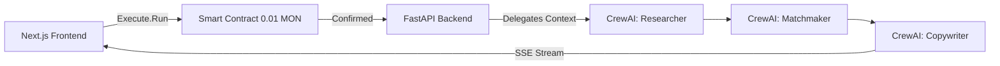

# ⚡ AGESTHETIC (IntroAgent)

> **Warm intros > Cold outreach.**
> 
> *Cyberpunk / Dark Maximalist AI Framework for generating Web3-verified intro messages.*

Agesthetic is a dynamic Multi-Agent AI system designed to find the best intermediary from event/network data and craft highly personalized X (Twitter) DM drafts. Complete with a **Next.js 15 Web3 Terminal** and a **FastAPI + CrewAI** backend.

## 🚀 Features

- **Cyberpunk UI**: A visually striking, dark maximalist interface with Web3 wallet gating (Monad Testnet).
- **Matchmaker Agent**: Analyzes mock event attendees to find the best mutual connection to a target person.
- **Copywriter Agent**: Writes personalized, non-spammy DMs in JSON format.
- **Secure Fallbacks**: Graceful degradation in case of Gemini Free Tier rate-limits (Mock payloads).
- **Web3 Payments**: Requires a 0.01 MON Testnet transaction to initiate the execution sequence via RainbowKit & Wagmi.

## 🏗️ Architecture



## 🛠️ Tech Stack

### Frontend
- Next.js 15 (App Router)
- React 19
- CSS Modules (Vanilla Custom Variables)
- RainbowKit, Wagmi, Viem (Web3 Core)

### Backend
- Python 3.11+
- FastAPI (SSE Streaming)
- CrewAI (Agent Orchestration)
- Google Gemini 2.0 API (LLM Engine)

## 📦 Local Setup

### 1. Clone the repository
```bash
git clone https://github.com/your-username/agesthetic.git
cd agesthetic
```

### 2. Backend (Python/FastAPI)
```bash
# Create and activate virtual environment
python3 -m venv .venv
source .venv/bin/activate  # Windows: .venv\Scripts\activate

# Install dependencies
pip install -e ".[dev]"

# Set Environment Variables
cp .env.example .env
# Important: Open .env and add your GOOGLE_API_KEY from Google AI Studio.

# Run Backend
uvicorn src.api:app --reload --port 8000
```
> API will run at `http://localhost:8000`

### 3. Frontend (Next.js/Web3)
```bash
# Open a new terminal tab
cd frontend

# Install Node modules
npm install

# Setup Web3 Project ID (Optional for local testing)
echo "NEXT_PUBLIC_WALLETCONNECT_PROJECT_ID=c022837ba23c8a9ed409d5beac3c5ee9" > .env.local

# Run Development Server
npm run dev
```
> UI will run at `http://localhost:3000`

## 💻 Usage
1. Make sure you have the **Metamask** extension installed and the **Monad Testnet** configured.
2. Open `http://localhost:3000` in your browser.
3. Select an attendee from the "Network Graph" on the right sidebar.
4. Input your purpose and hit **Execute Analysis**.
5. Log into your wallet and approve the 0.01 MON payment.
6. The terminal will stream the agent analysis and pop up the copyable DM templates.

## 📄 License
MIT
